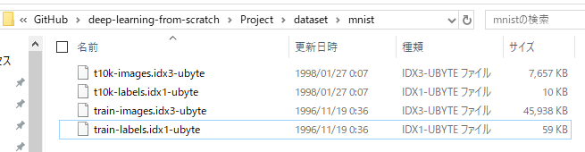

# deep-learning-from-scratch
ゼロから作るDeepLearningの内容をC#で書いていきます。 
元ネタはこちら。 
https://github.com/oreilly-japan/deep-learning-from-scratch
  
WPFのグラフの部分はこちらを参考にしています。 
https://github.com/Fujiwo/CSharpNeuralNetworkSample-AI-decode
  
MINSTデータは再配布できるか微妙だったので各自ダウンロードしてください。 
http://yann.lecun.com/exdb/mnist/
 
以下のデータをダウンロードして展開。 
- train-images-idx3-ubyte.gz:  training set images (9912422 bytes)
- train-labels-idx1-ubyte.gz:  training set labels (28881 bytes)
- t10k-images-idx3-ubyte.gz:   test set images (1648877 bytes)
- t10k-labels-idx1-ubyte.gz:   test set labels (4542 bytes)
 

dataset/mnist以下にこんな感じで格納してください。 
 
   
 WpfAppをスタートアッププロジェクトに設定して実行すると以下のような画面が出ます。ツリーの各要素をクリックすると実行されます。実行結果のグラフとログが出力されるようになっています。Ch4/gradient_2dはグラフ出力をあきらめました。